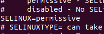
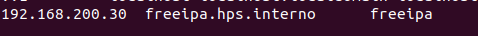
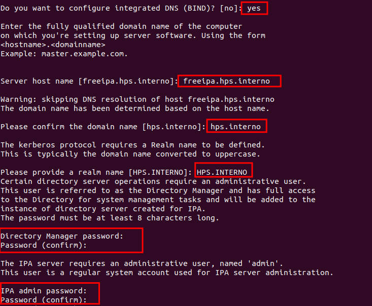
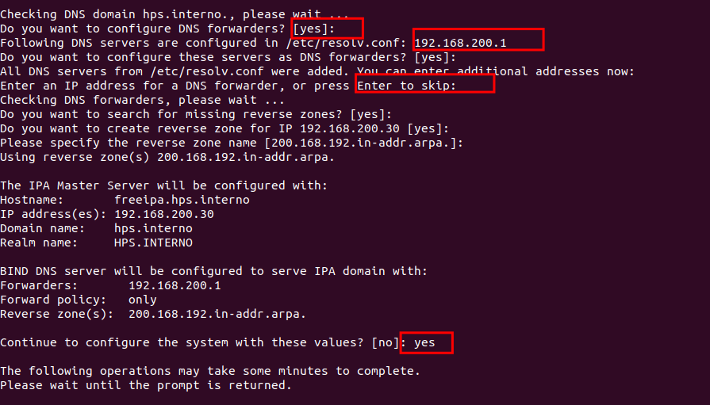

# Pré requisitos
1. Servidor CentOS 7
2. 2 vcpu
3. 2 gb ram
4. 20 gb hd

# Configuração
Configure o hostname
```
hostnamectl set-hostname "freeipa.hps.interno"
exec bash
```
Atualize o servidor
```
yum update
```
Altere o SElinux para Permissive
```
nano /etc/selinux/config 
```


Adicione o IP e o hostname no hosts e reinicie
```
nano /etc/hosts
```


Firewall
```
firewall-cmd --permanent --add-service={ntp,http,https,ldap,ldaps,kerberos,kpasswd,dns}
```
```
firewall-cmd --zone=public --add-port={80/tcp,443/tcp,389/tcp,636/tcp,88/tcp,464/tcp,53/tcp,7389/tcp,88/udp,464/udp,53/udp,123/udp}
```
```
sudo firewall-cmd --runtime-to-permanent
```
```
firewall-cmd --reload
```

Reinicie o servidor

# Instalação

Instale as dependencias do FreeIPA
```
yum install ipa-server ipa-server-dns -y
```
Instale o Freeipa
```
ipa-server-install
```
Responda as perguntas de acordo com as imagem abaixo:



